# Loss Defender Pro — Data Flow & Sequence Diagrams

**Enterprise Warehouse Intelligence Platform**

| | |
|:---|:---|
| **Document Version** | 3.0 |
| **Status** | Production Design Specification |
| **Companion Docs** | SRS, Architecture, Database Design, OpenAPI |
| **Date** | 05 August 2026 |

> **CONFIDENTIAL — Engineering Use Only**

---

## Table of Contents

### Part A — Data Flow Diagrams
1. Context Diagram (Level 0)
2. Level-1 DFD — Major Processes
3. Data Stores Catalogue
4. External Entities & Data Flows Summary

### Part B — Sequence Diagrams
5. Authentication (Register / Login / Refresh / Forgot Password)
6. Company & User Onboarding (Invite flow)
7. Order Ingestion (Marketplace Sync + Manual Create)
8. Packing Flow (Assign → Scan → Record → Upload → Evidence)
9. Dispatch & Shipment Status Update
10. Claim Lifecycle (Create → Evidence → Decide)
11. Return Lifecycle
12. Marketplace Webhook Handling
13. Notification Delivery
14. Background Worker Flows (AI, Email, Sync)

### Part C — Component Interaction
15. Runtime Component Communication Map
16. Error & Retry Patterns

---

## Part A — Data Flow Diagrams

### 1. Context Diagram (Level 0)

The system as a single process interacting with external entities. Shows what crosses the system boundary.

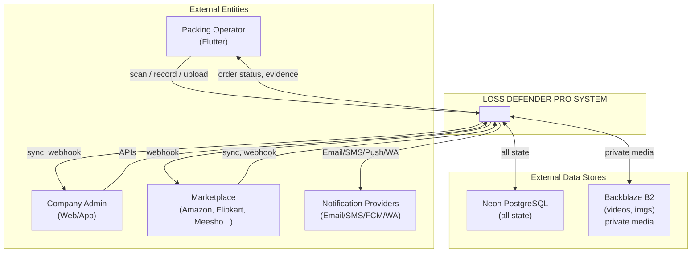

**External entities:** Packing Operator (Flutter), Company Admin (Web/App), Marketplaces, Notification providers.
**Data stores outside process:** Neon DB, Backblaze B2.

---

### 2. Level-1 DFD — Major Processes

The system decomposed into major processes. Arrows are labelled data flows; cylinders are data stores.

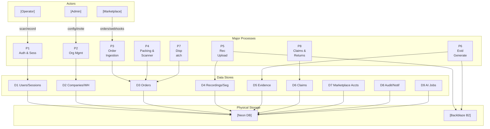

#### 2.1 Process Catalogue

| ID | Process | Responsibility |
|:---|:---|:---|
| P1 | Auth & Sessions | Register, login, JWT, refresh, OTP, sessions |
| P2 | Org Management | Company profile, warehouses, stations, user invite, RBAC |
| P3 | Order Ingestion | Marketplace sync, webhooks, manual order create, mapping |
| P4 | Packing & Scanner | Queue, operator assign, barcode validate, qty checks |
| P5 | Recording Upload | Start/stop session, multipart upload to B2, segment tracking |
| P6 | Evidence Generate | Frame extract, overlays, checksum, signed URLs, AI hooks |
| P7 | Dispatch | Status → dispatched/shipped, AWB, courier, story |
| P8 | Claims & Returns | Claim/return lifecycle, evidence attach, decide, marketplace reply |
| P9 | Notify (implied) | Enqueue email/SMS/push/in-app based on events |
| P10 | Analytics (implied) | Aggregate KPIs from orders/claims/recordings |

---

### 3. Data Stores Catalogue

| Store | Physical | Primary Content | Written by | Read by |
|:---|:---|:---|:---|:---|
| D1 Users/Sessions | Neon | users, sessions, tokens, roles | P1, P2 | P1–P8 |
| D2 Companies/WH | Neon | companies, warehouses, stations | P2 | P2–P8 |
| D3 Orders | Neon | orders, order_items, status_history | P3, P4, P7 | P3–P8 |
| D4 Recordings | Neon + B2 | recordings, segments metadata; video in B2 | P5 | P5, P6, P8 |
| D5 Evidence | Neon + B2 | evidence, frames; images in B2 | P6 | P6, P8 |
| D6 Claims/Returns | Neon | claims, returns, attachments | P8 | P8, Analytics |
| D7 Mkt Accounts | Neon | OAuth/API credentials (encrypted) | P3 | P3 |
| D8 Audit/Notif | Neon | audit_logs, notifications | All | Admin, P9 |
| D9 AI Jobs | Neon + Redis | ai_jobs queue state | P6, Workers | Workers |
| Redis | Redis | OTP, rate-limit, BullMQ jobs, cache | P1, Workers | P1, Workers |

---

### 4. Key Data Flows Summary

| From → To | Data | Trigger |
|:---|:---|:---|
| Marketplace → P3 | Order / shipment / claim payload | Webhook or scheduled sync |
| P3 → D3 | Normalised order + items | After mapping |
| Operator → P4 | Barcode, orderId | Scan action |
| P4 → D3 | scanned_qty, status=scanned | Validation OK |
| Operator → P5 | Start/stop, segments | Record packing |
| P5 → B2 | Video segment bytes | Multipart upload |
| P5 → D4 | Segment keys, checksums, status | Upload complete |
| P6 → B2 | Frame images, manifest | Evidence generation job |
| P6 → D5 | Evidence row + frame metadata | Job success |
| Claims Exec → P8 | Decision, notes | Review complete |
| P8 → Marketplace | Claim reply / evidence link | Approved/rejected |
| Any P* → D8 | Audit event | Critical mutation |
| Any P* → P9 | Notification intent | Domain event |
| P9 → Provider | Email/SMS/Push payload | Worker dequeue |

---

## Part B — Sequence Diagrams

Actors and components on the top; time flows downward. Focus is on happy path + important error/branch.

---

### 5. Authentication Sequences

#### 5.1 Register (Company + Owner)

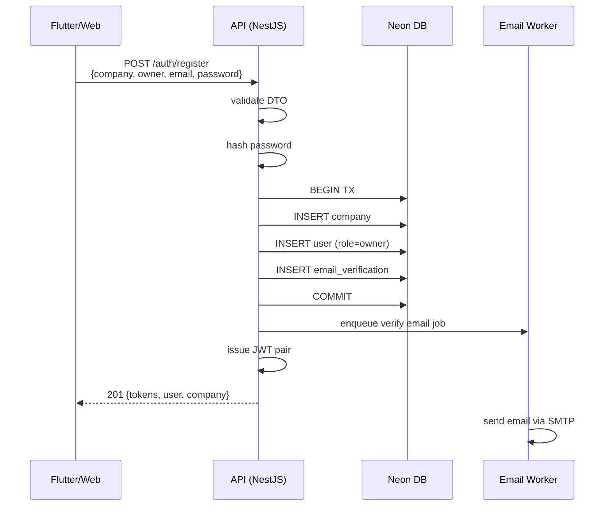

**Errors:** 409 if email exists; 400 validation. Email always async (job queue).

---

#### 5.2 Login

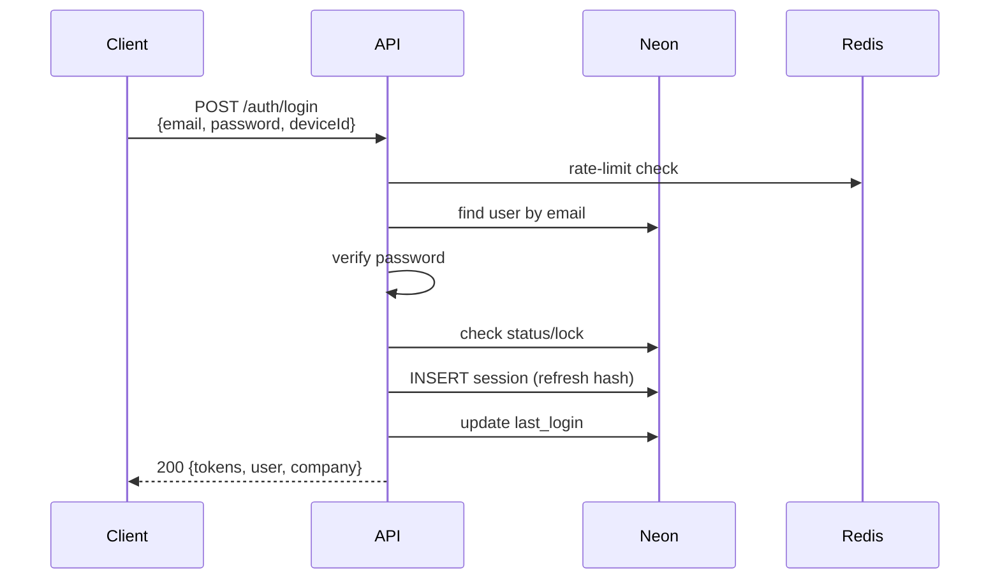

**On failure:** increment failed_login_count; lock if threshold exceeded. 401 always generic.

---

#### 5.3 Token Refresh

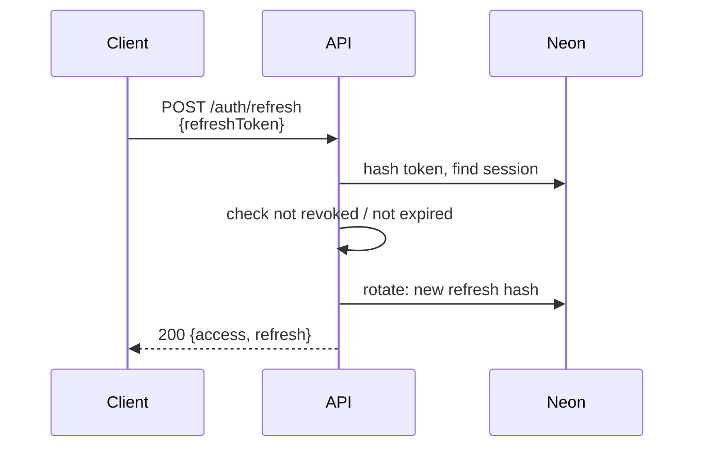

**Reuse of an already-rotated refresh token → revoke all sessions (theft detection).**

---

#### 5.4 Forgot / Reset Password

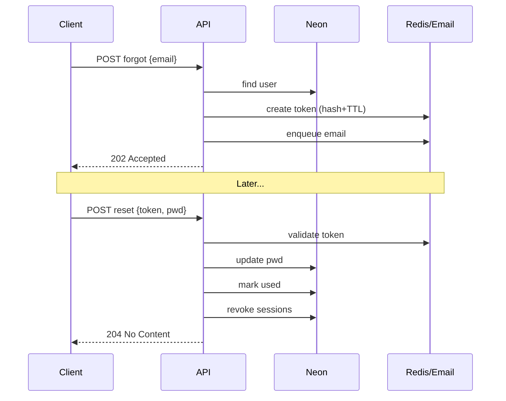

---

### 6. User Invite Sequence

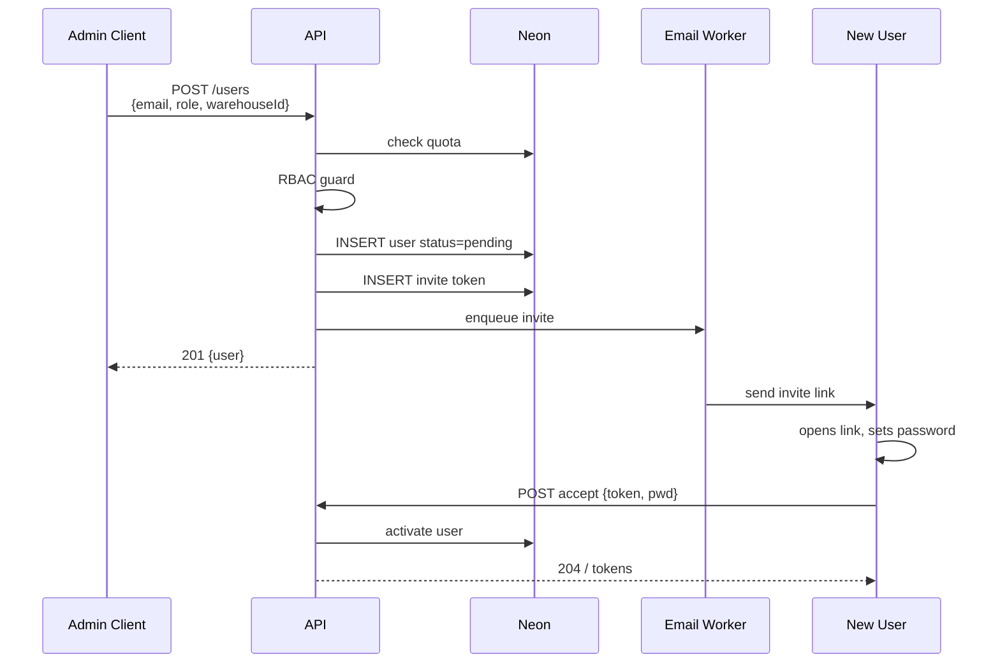

---

### 7. Order Ingestion

#### 7.1 Marketplace Scheduled Sync

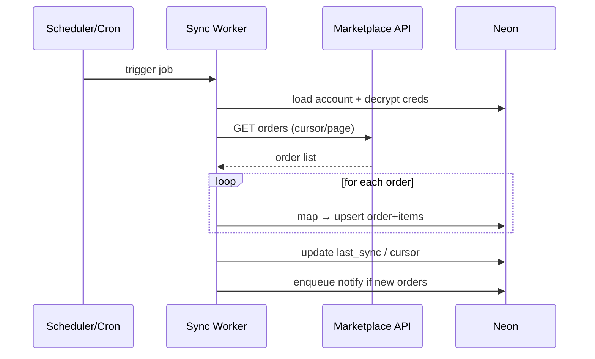

---

#### 7.2 Manual Order Create

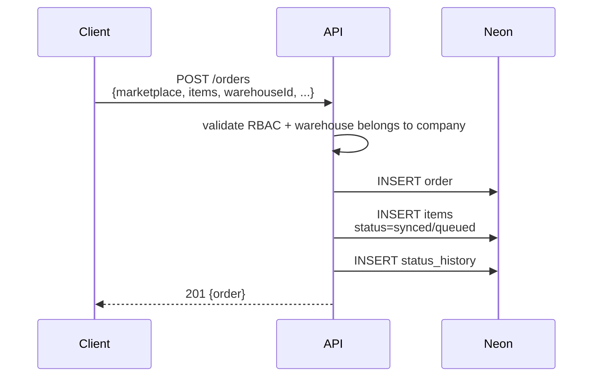

---

### 8. Packing Flow (Core Happy Path)

**Assign → Scan → Record → Upload segments → Evidence**

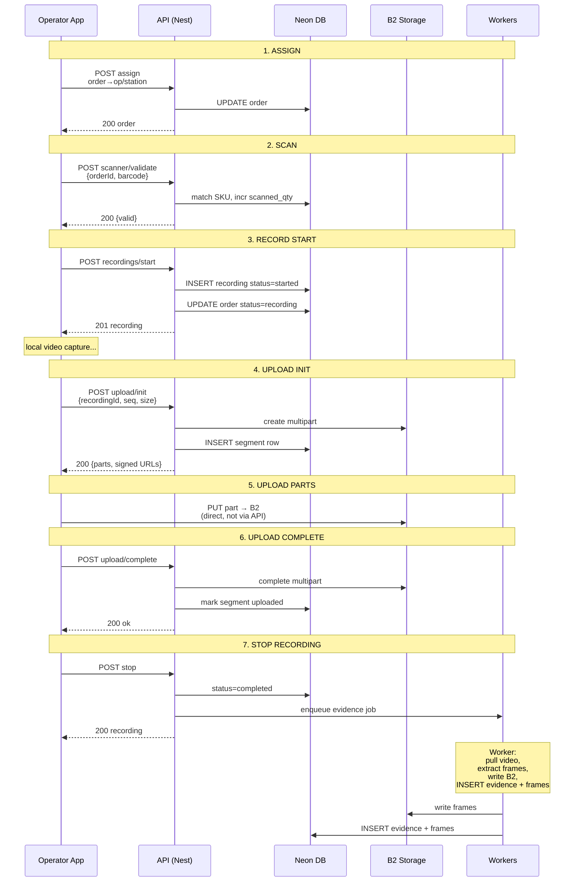

---

### 9. Dispatch Sequence

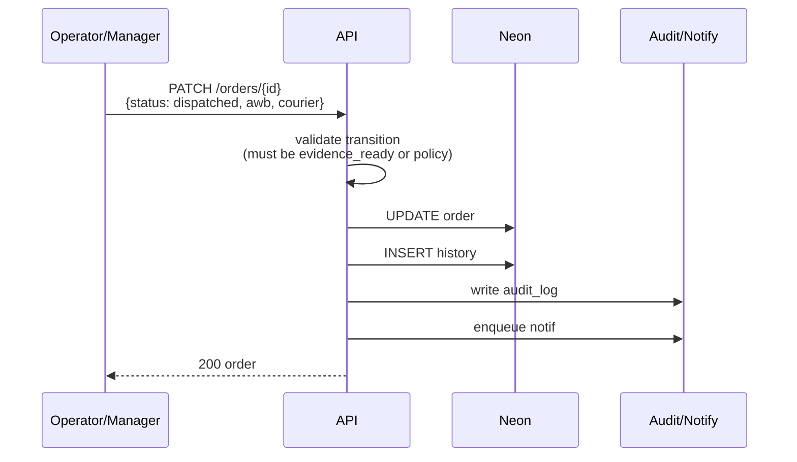

---

### 10. Claim Lifecycle Sequence

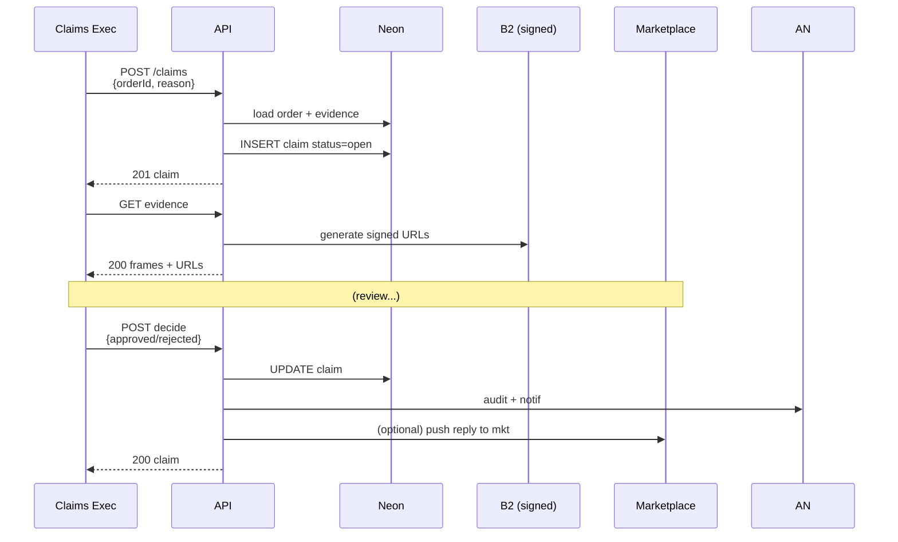

---

### 11. Return Lifecycle (Summary)

Similar to claims: **create → receive** (optional unboxing recording via packing flow) **→ inspect → decide** (refund/restock/reject). Evidence/recording attached via `unboxing_recording_id`. Decision writes audit + notif.

---

### 12. Marketplace Webhook Sequence

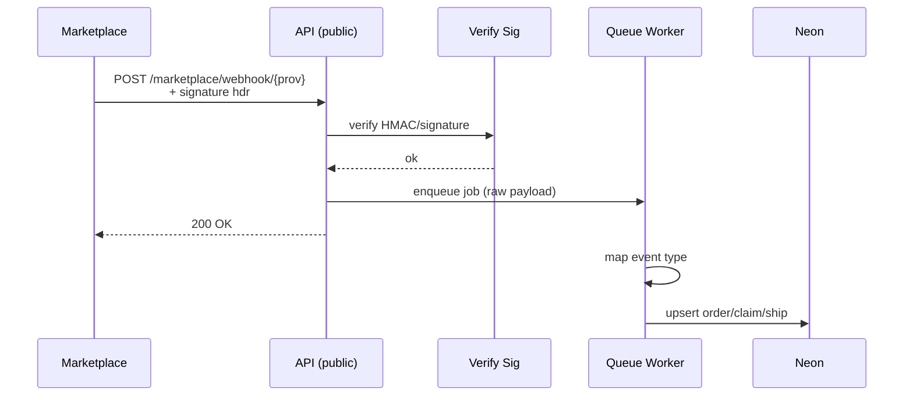

**Notes:** Signature check + enqueue. Processing is async. Idempotency key = provider event id.

---

### 13. Notification Delivery Sequence

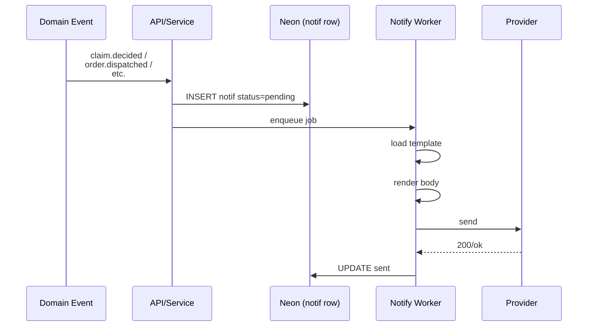

---

### 14. Background Worker Flows

#### 14.1 Typical BullMQ / Redis Worker Pattern

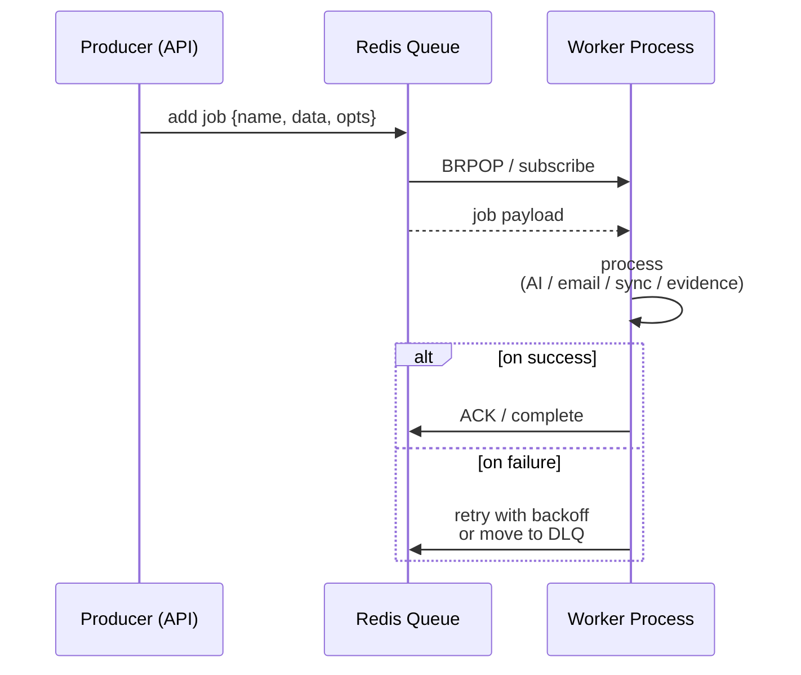

---

#### 14.2 Worker Types

| Queue | Job types | Side effects |
|:---|:---|:---|
| email | verify, invite, reset, claim_update | SMTP/SendGrid |
| marketplace-sync | orders_pull, shipments, im | Upsert D3/D6; update D7 |
| evidence | generate_from_recording | Read B2 video; write frames; D5 |
| ai | object_detect, ocr, mry | Update ai_jobs + optional evidence |
| notify | push, sms, whatsapp | FCM/SMS/WA providers |

---

## Part C — Component Interaction

### 15. Runtime Component Communication Map

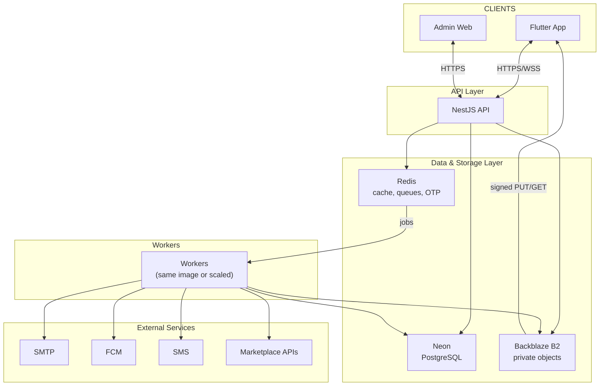

**Critical Rule:** Clients never talk to Redis, Neon, or B2 directly (except B2 via short-lived signed URLs issued by the API). Workers share the same DB and B2 credentials as the API.

---

### 16. Error & Retry Patterns

#### 16.1 API Layer

| Scenario | Response | Details |
|:---|:---|:---|
| Validation errors | 400 | With field details |
| Auth failures | 401 | Generic message |
| RBAC / tenant mismatch | 403 | — |
| Missing resource | 404 | — |
| Invalid state transition / duplicate | 409 | — |
| Rate limit | 429 | + Retry-After header |
| Unexpected | 500 | + requestId (logged with stack) |

#### 16.2 Upload Resilience

- Client may retry `upload/init`; server returns existing in-progress multipart if same `recording+seq`.
- Part PUT failures retried client-side against same signed URL until expiry.
- `upload/complete` is idempotent if segment already completed.

#### 16.3 Worker Resilience

- Exponential backoff with jitter; max attempts then dead-letter queue.
- Jobs carry idempotency keys (`orderId`, `recordingId`, `eventId`).
- Poison messages inspected via admin tooling; re-queue after fix.

---

> **Closing Statement**
>
> These DFDs and sequence diagrams are the behavioural companion to the Architecture, Database Design, and OpenAPI documents. Implementers should treat the sequences as the authoritative interaction contracts between Flutter, NestJS, workers, Neon, and Backblaze.

---

*End of Volume 2B: Data Flow & Sequence Diagrams — Version 3.0 • Confidential • PrimeCore Technologies*
